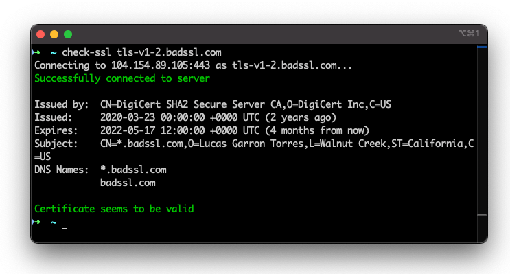

# go-check-ssl

Simple command line utility to check the status of an SSL certificate.

Basically, it attempts to establish a TLS connection to a server and reports back useful info about the cert's status.

## Usage

Either build it yourself or grab a pre-compiled download from the [Releases](https://github.com/colinodell/go-check-ssl/releases) page.

To check a certificate, simply run:

```bash
./check-ssl [server]
```



Example of allowed arguments include:

 - `example.com`
 - `example.com:443`
 - `https://www.example.com:443/foo/bar`
 - `93.184.216.34`

By default, it'll resolve the IP of the given domain and test against that server.  But you can also use this tool to check other servers by providing two arguments: the server to test and the SNI to use.  For example:

```bash
./check-ssl [server] --sni=[SNI domain]

./check-ssl example.com --sni=foo.example.com
```
